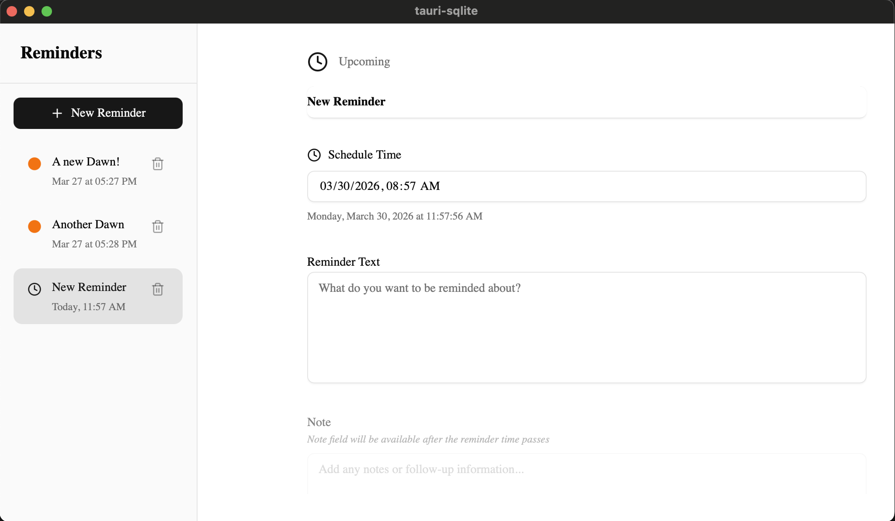

# reminder-app

This template should help get you started developing with Apalis, Tauri, React and Typescript in Vite.



## Getting Started

You need to setup tauri first:

- https://v2.tauri.app/reference/cli/

## Running

```bash
yarn install
yarn tauri dev
```


## Recommended IDE Setup

- [VS Code](https://code.visualstudio.com/) + [Tauri](https://marketplace.visualstudio.com/items?itemName=tauri-apps.tauri-vscode) + [rust-analyzer](https://marketplace.visualstudio.com/items?itemName=rust-lang.rust-analyzer)
